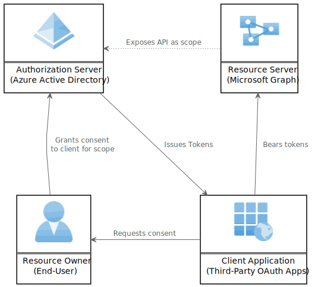
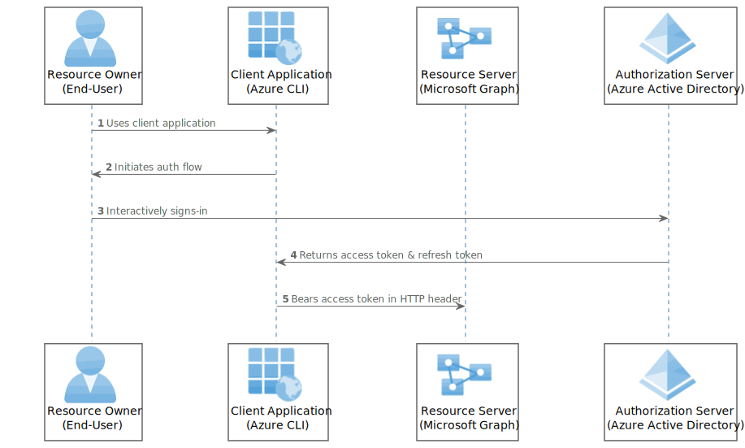
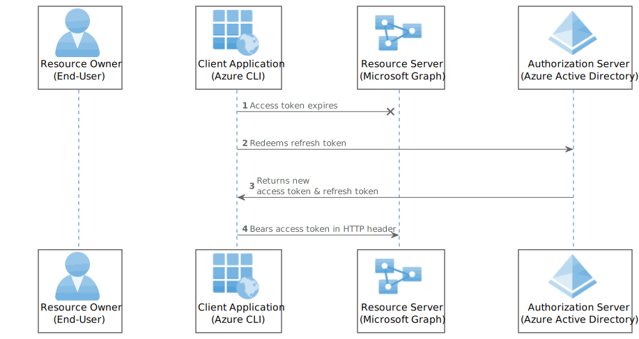
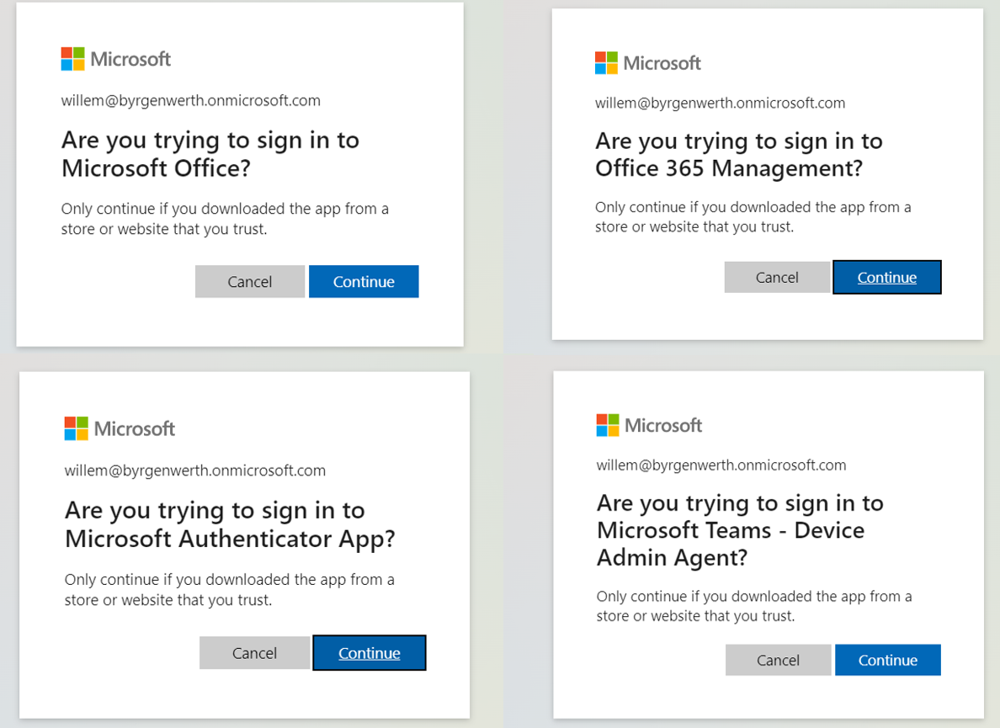
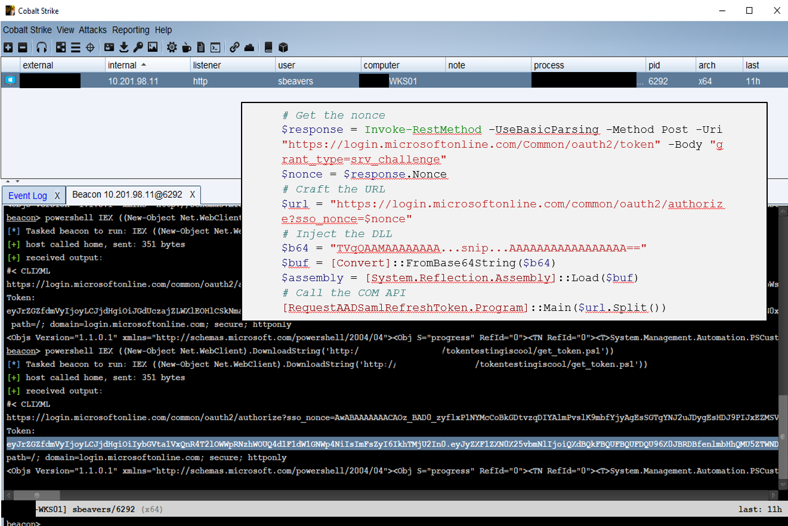
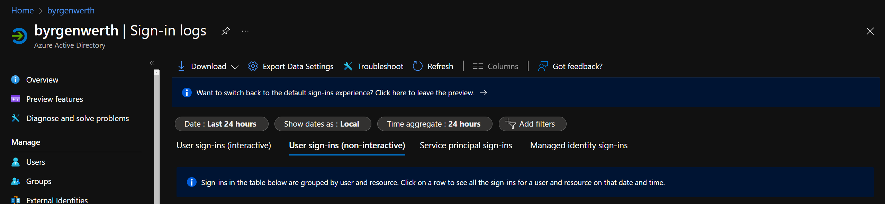
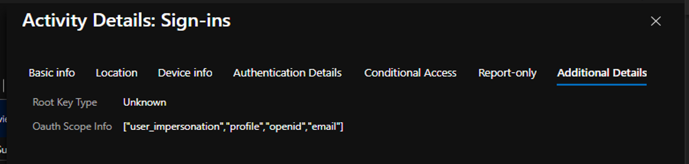

---
jupyter:
  jupytext:
    text_representation:
      extension: .md
      format_name: markdown
      format_version: '1.3'
      jupytext_version: 1.13.7
  kernelspec:
    display_name: Python 3
    language: python
    name: python3
---

[](https://mybinder.org/v2/gh/secureworks/family-of-client-ids-research/HEAD?urlpath=lab%2Ftree%2FREADME.ipynb)

# Abusing Family Refresh Tokens for Unauthorized Access and Persistence in Azure Active Directory

- Ryan Marcotte Cobb, CTU Special Operations
- Tony Gore, CTU Special Operations

Undocumented functionality in Azure Active Directory allows a group of Microsoft OAuth client applications to obtain special “family refresh tokens,” which can be redeemed for bearer tokens as any other client in the family. We will discuss how this functionality was uncovered, the mechanism behind it, and various attack paths to obtain family refresh tokens. We will demonstrate how this functionality can be abused to access sensitive data. Lastly, we will share relevant information to mitigate the theft of family refresh tokens.

## Table of Contents

- [Part 1 - Azure Active Directory and OAuth 2.0](#part-1---azure-active-directory-and-oauth-20)
  - [Granting Consent](#granting-consent)
  - [Grant Flows](#grant-flows)
    - [Example 0 - Install Dependencies](#example-0---install-dependencies)
    - [Example 1 - Device Code Flow](#example-1---device-code-flow)
  - [Bearer Tokens](#bearer-tokens)
    - [Example 2 - Decode Access Token](#example-2---decode-access-token)
    - [Example 3 - Use Access Token to Call Graph API](#example-3---use-access-token-to-call-graph-api)
    - [Example 4 - Redeem Refresh Token](#example-4---redeem-refresh-token)
  - [Refresh Tokens: Specification vs. Implementation](#refresh-tokens-specification-vs-implementation)
    - [Example 5 - Documented AAD Refresh Token Behavior: Different Scopes](#example-5---documented-aad-refresh-token-behavior-different-scopes)
    - [Example 6 - Undocumented AAD Refresh Token Behavior: Different Clients](#example-6---undocumented-aad-refresh-token-behavior-different-clients)
- [Part 2 - Introducing Family of Client IDs & Family Refresh Tokens](#part-2---introducing-family-of-client-ids--family-refresh-tokens)
  - [Experiments](#experiments)
  - [*What is the mechanism and purpose behind this undocumented behavior?*](#what-is-the-mechanism-and-purpose-behind-this-undocumented-behavior)
  - [*Which client applications are compatible with each other?*](#which-client-applications-are-compatible-with-each-other)
  - [*What are the security implications of Family Refresh Tokens?*](#what-are-the-security-implications-of-family-refresh-tokens)
    - [Example 7 - Privilege Differences between Access Tokens](#example-7---privilege-differences-between-access-tokens)
    - [Example 8 - Family Refresh Token Chaining](#example-8---family-refresh-token-chaining)
- [Part 3 - Attack Paths](#part-3---attack-paths)
  - [Device Code Phishing](#device-code-phishing)
  - [Abusing Single Sign-On](#abusing-single-sign-on)
- [Part 4 - Mitigations against Family Refresh Tokens](#part-4---mitigations-against-family-refresh-tokens)
  - [Conditional Access Policies](#conditional-access-policies)
  - [Auditing Sign-In Logs](#auditing-sign-in-logs)
  - [Revoking Refresh Tokens](#revoking-refresh-tokens)
- [Conclusion](#conclusion)

# Part 1 - Azure Active Directory and OAuth 2.0

Azure Active Directory (Azure AD) is a cloud-based identity and access management (IAM) platform developed by Microsoft. Microsoft uses Azure AD as the IAM provider for its own cloud services, such as Microsoft 365 and Azure Resource Manager. Azure AD implements the [OAuth 2.0](https://www.oauth.com/) and [OpenID Connect](https://openid.net/connect/) (OIDC) standards as the foundation for its authorization and authentication functionality, respectively. OAuth 2.0 is an authorization framework that lets resource owners (usually end-users) delegate permissions to client applications to access web services on their behalf. The IETF standard for OAuth 2.0 was originally defined in [RFC 6749](https://datatracker.ietf.org/doc/html/rfc6749). Additional technical specifications were later ratified to detail use-cases that were not addressed in RFC 6749. Even with active development on the OAuth 2.0 standard, Microsoft pushes the boundaries of its design to support the sheer scale and variety of services that rely on Azure AD. 

This research focuses on the OAuth 2.0 implementation in Azure AD. We will highlight a few important differences between the implementation in Azure AD and the OAuth 2.0 specification. We will explore the security implications of these differences and demonstrate how an attacker can abuse Azure AD implementation quirks for privilege escalation and persistent access to Microsoft cloud resources. Lastly, we will share how we weaponized this undocumented feature for red team operations at Secureworks, as well as a few mitigations to protect your organization against it.

## Granting Consent



The OAuth 2.0 protocol typically involves four participants:

The resource server (RS) is a web service that protects information or capabilities belonging to a resource owner (RO).  The resource owner usually represents an end-user. The resource server should only allow the authorized delegates of the resource owner to access the protected resources. The resource server may categorize different kinds of protected resources into [scopes](https://datatracker.ietf.org/doc/html/rfc6749#section-3.3). Scopes are granular permissions on the resource server that the resource owner can delegate to client applications (CA).

The resource owner can allow client applications to have limited access to resource servers by explicitly granting consent to specific scopes. Both the resource server and the resource owner trust the authorization server (AS). The authorization server is responsible for keeping track of the scopes on the resource server that the resource owner granted to the client application.

Microsoft 365 is a suite of productivity software-as-a-service solutions, and it uses Azure AD as its IAM provider. Microsoft 365 apps are deeply integrated through a complex web of service dependencies between OAuth applications. Each solution is instantiated as one (or more) OAuth client applications, resource servers, or both in the Azure AD tenant. Many of these Microsoft “first-party” OAuth applications are automatically provisioned in tenant with each deployment of Microsoft 365. 
 
To ensure these dependencies are met, many first-party applications are granted (what Microsoft describes as) “implied consent”, sometimes called “pre-consent” or “pre-authorization”. Microsoft wants to hide this complexity, so first-party client applications and their pre-consented scopes are invisible to users and administrators. Our research focused on these first-party client applications and the sensitive scopes that were “pre-authorized” for them on behalf of all users.

## Grant Flows
When the resource server receives a web request from a client application, it needs to confirm that the client application has consent and authorization by the resource owner to access the requested resources. As previously stated, the authorization server is responsible for keeping track of what the resource owner delegated to the client application. Therefore, the resource server needs some form of proof from the authorization server that the client application is authorized for what it is requesting. 

The OAuth 2.0 specifications define a variety of protocols - called grant flows - involving an authorization server, client application, and (usually) the resource owner. All grant flows result in the authorization server issuing temporary credentials – called [bearer tokens](https://datatracker.ietf.org/doc/html/rfc6750) – to the client application that will grant access when presented to the resource server. All bearer tokens are issued to the client application by the authorization server.

Here is a simplified diagram of the [authentication code grant flow](https://datatracker.ietf.org/doc/html/rfc6749#section-4.1):



Although technically outside of the OAuth 2.0 spec, authorization grant flows typically involve an authentication step (defined in a different protocol, such as OpenID Connect) wherein the resource owner proves their identity to the authentication server. Proof of identity usually requires a password or certificate in addition to other authentication challenges, like multi-factor authentication. 

Some grant flows require proof of identity for the user, while others require proof of identity for the application itself. Client applications that have their own passwords or certificates are called "confidential" clients, while clients that do not need their own proof of identity are called "public" clients. It is important to note that an attacker can masquerade as the public client application when requesting tokens from the authorization server. Since public clients do not have their own credentials, the authentication server has no way to prove that the authorization grant originates from the legitimate application. 


### Example 0 - Install Dependencies

> The examples in this notebook require the [`msal`](https://msal-python.readthedocs.io/en/latest/) and [`pyjwt`](https://pyjwt.readthedocs.io/en/stable/) packages. If not already installed, we can pip install them in the current kernel by uncommenting and running the cell below. After the packages have been installed, we need to restart your kernel before proceeding with the rest of the notebook.

```python
#!pip install -r requirements.txt

import msal
import requests
import jwt
import pandas as pd
pd.options.display.max_rows = 999

from pprint import pprint
from typing import Any, Dict, List
```

Let's authorize a Microsoft public client application using Python. In this example, we will complete an device authorization grant flow as the Azure CLI  public client application (Client ID: `04b07795-8ddb-461a-bbee-02f9e1bf7b46`). Since the Azure CLI is a public client, it does not have its own secrets and Azure AD cannot verify whether the authorization request originates from the legitimate commandline tool or an attacker. We will request bearer tokens authorized for the `.default` scope on the modern Microsoft Graph. Note that `msal` [automatically adds](https://github.com/AzureAD/microsoft-authentication-library-for-python/blob/dev/msal/application.py#L481) the `offline_access`, `profile`, and `openid` scopes to the request. The scope `offline_access` instructs the Azure AD to return a refresh token in addition to an access token and ID token. We will look closer at these tokens shortly.

### Example 1 - Device Code Flow

```python
azure_cli_client = msal.PublicClientApplication(
    "04b07795-8ddb-461a-bbee-02f9e1bf7b46" # ID for Azure CLI client
)

device_flow = azure_cli_client.initiate_device_flow(
    scopes=["https://graph.microsoft.com/.default"]
)

print(device_flow["message"])

```

After the resource owner authenticates and authorizes the grant flow, the client application can acquire bearer tokens from the authorization server.

```python
azure_cli_bearer_tokens_for_graph_api = azure_cli_client.acquire_token_by_device_flow(
    device_flow
)

pprint(azure_cli_bearer_tokens_for_graph_api)
```

We should now have a set of bearer tokens for the Azure CLI client application.

## Bearer Tokens

Bearer tokens get their name because [“any party in possession of the token (a “bearer”) can use the token in any way that any other party in possession of it can use.”](https://datatracker.ietf.org/doc/html/rfc6750#section-1.2) Bearer tokens expire over time, after which the client application will need a new authorization from the resource owner. The [standard representation](https://datatracker.ietf.org/doc/html/rfc7523) for bearer tokens are [JSON Web Tokens](https://jwt.io/introduction) (JWT). Azure AD uses three types of bearer tokens: ID tokens, access tokens, and refresh tokens:

| Type          | Standard  | Lifetime |
| ------------- | --------- | -------- |
| ID Token      | OIDC      | 1 Hour   |
| Access Token  | OAuth 2.0 | 1 hour   |
| Refresh Token | OAuth 2.0 | 90 days  |

**ID tokens** contain information about the resource owner, such as their friendly name, user principal name, and location. ID tokens are defined in the OIDC standard and are outside of the scope of this research. We will instead focus on the other two types of tokens.

**Access tokens** are the credentials used to access protected resources. Client applications must pass an access token with each web request to the resource server. Access tokens [represent specific scopes and durations](https://datatracker.ietf.org/doc/html/rfc6749#section-1.4) of access that the resource owner authorized for the client application. Note that access tokens contain *claims* with information about:

- the provenance of the token (`iss`)
- the resource owner and client application (`oid`/`upn`, `appid`)
- the authorized scopes (`scp`)
- the issuance and expiration times (`iat`, `exp`)
- the resource server (`aud`)
- the authentication methods that the resource owner used to authorize the client application (`amr`)
- and much more


Let's take a closer look at the access token we acquired in the previous example. We will use `pyjwt` to decode the JSON blob and inspect its contents:

### Example 2 - Decode Access Token

```python
def decode_jwt(base64_blob: str) -> Dict[str, Any]:
    """Decodes base64 encoded JWT blob"""
    return jwt.decode(
        base64_blob, options={"verify_signature": False, "verify_aud": False}
    )


decoded_access_token = decode_jwt(
    azure_cli_bearer_tokens_for_graph_api.get("access_token")
)

pprint(decoded_access_token)

```

We can pass the access token in the header of a web request to access the Microsoft Graph as the resource owner. The Graph endpoint `/me/oauth2PermissionGrants` returns a list of OAuth 2.0 permission grants, which represent consent granted by the user to client applications for specific scopes. The same approach can be used to call any other Graph endpoint - so long as the access token contains the [necessary scopes](https://docs.microsoft.com/en-us/graph/permissions-reference). In the case of `/me/oauth2PermissionGrants`, access tokens must have a scope containing `Directory.Read.All`, `DelegatedPermissionGrant.ReadWrite.All`, `Directory.ReadWriteAll`, or `Directory.AccessAsUser.All` to call this API endpoint.

### Example 3 - Use Access Token to Call Graph API

```python
def check_my_oauth2PermissionGrants(access_token: str) -> Dict[str, Any]:
    """Lists OAuth2PermissionGrants for the authorized user."""
    url = "https://graph.microsoft.com/beta/me/oauth2PermissionGrants"
    headers = {
        "Content-Type": "application/json",
        "Authorization": f"Bearer {access_token}",
    }
    return requests.get(url, headers=headers).json()


check_my_oauth2PermissionGrants(
    azure_cli_bearer_tokens_for_graph_api.get("access_token")
)

```

> Note that the Azure CLI client application does not appear in the list of permission grants because it has been "pre-authorized" by Microsoft. There are many of these first-party client applications in an Azure AD tenant by default.

Access tokens expire after a short period of time, usually one hour. Once an access token has expired, the client application will need to obtain a new access token to continue accessing protected resources. The client application can either request authorization from the resource owner again or use a refresh token to obtain new access tokens based on the prior authorization.

**Refresh tokens** are a special type of bearer token representing the authorization granted by the resource owner to the client application. Client applications can redeem refresh tokens with the authorization server to obtain a new set of bearer tokens (including another refresh token) after the originally issued access token has expired and  without requiring new authorization from the resource owner. Refresh tokens are much longer-lived than access tokens; most refresh tokens issued by Azure AD are valid for 90 days. The refresh tokens contain an opaque blob that is encrypted by the authorization server. As such the exact content of refresh tokens is unknown.



Here is a textbook example of a refresh token grant. We are redeeming the previously obtained refresh token for new bearer tokens bound to the same client and scopes as the original authorization:

### Example 4 - Redeem Refresh Token

```python
new_azure_cli_bearer_tokens_for_graph_api = (

    # Same client as original authorization
    azure_cli_client.acquire_token_by_refresh_token( 
        azure_cli_bearer_tokens_for_graph_api.get("refresh_token"),

        # Same scopes as original authorization
        scopes=["https://graph.microsoft.com/.default"], 
    )
)

pprint(new_azure_cli_bearer_tokens_for_graph_api)

```

## Refresh Tokens: Specification vs. Implementation

Because refresh tokens are long-lived credentials, they are attractive targets for malicious actors. [“If an attacker is able to exfiltrate and successfully replay a refresh token, the attacker will be able to mint access tokens and use them to access resource servers on behalf of the resource owner.”](https://datatracker.ietf.org/doc/html/draft-ietf-oauth-security-topics#section-4.13.1) The [IETF threat model](https://datatracker.ietf.org/doc/html/rfc6819#section-4.5) for OAuth 2.0 elucidates the various ways an attacker could obtain refresh tokens. 

The OAuth 2.0 specifications include safeguards to mitigate the potential risk from refresh token theft:

- Safeguard #1: **Same Scopes** - Refresh tokens should only be able [“to obtain access tokens with identical or narrower scope”](https://datatracker.ietf.org/doc/html/rfc6749#section-1.5) as the original authorization.  The most recent guidance from the IETF OAuth working group explains that [“refresh tokens MUST be bound to the scope and resource servers as consented by the resource owner… to prevent privilege escalation by the legitimate client and reduce the impact of refresh token leakage.”](https://datatracker.ietf.org/doc/html/draft-ietf-oauth-security-topics#section-4.13.2) And if the authorization server issues a new refresh token during a refresh token grant, [“the refresh token scope MUST be identical to that of the refresh token included by the client in the request.”](https://datatracker.ietf.org/doc/html/rfc6749#section-6)

- Safeguard #2: **Same Client** - Furthermore, refresh tokens are [“bound to the client to which it was issued”](https://datatracker.ietf.org/doc/html/rfc6749#section-6) and the [authorization server is responsible](https://datatracker.ietf.org/doc/html/rfc6749#section-10.4) for maintaining this binding.  The IETF threat model for OAuth2.0 clarifies that the refresh token should be bound to the original client identifier, which the [authorization server should validate](https://datatracker.ietf.org/doc/html/rfc6819#section-5.2.2.2) with each attempt to refresh tokens.  

In other words, the level of access provided by a refresh token should reflect what the resource owner originally authorized: for the same scopes, on the same resource server, and as the same client application.

Microsoft has a history of bending these rules with the legacy Azure AD feature called [“multi-resource refresh tokens”](https://www.cloudidentity.com/blog/2013/10/14/adal-windows-azure-ad-and-multi-resource-refresh-tokens/) (MRRTs). MRRTs effectively ignored the first safeguard for refresh tokens (limit access to the previously authorized scopes). Instead, MRRTs acted as “the OAuth2 equivalent of ticket granting tickets (TGTs) in Kerberos; they are artifacts that allow a user to obtain tokens to access resources the directory decides she or he has access to.” (*Modern Authentication with Azure Active Directory for Web Applications. Bertocci, Vittorio. 2019. Page 242-243*) MRRTs remained bound to the same user and client application, but Azure AD would redeem MRRTs for new bearer tokens scoped to any resources for which the client had been granted consent. Furthermore, MRRTs were not scoped by tenant. Client applications could “use MRRTs to ask for access tokens from any tenant in which the user has a guest account and has already granted consent for the client app originally used to obtain the first refresh token.” [ibid.]

MRRTs are no longer an optional feature; all Azure AD refresh tokens exhibit this behavior today. Microsoft [documentation](https://docs.microsoft.com/en-us/azure/active-directory/develop/refresh-tokens) clearly states “Refresh tokens are bound to a combination of user and client, but aren't tied to a resource or tenant… a client can use a refresh token to acquire access tokens across any combination of resource and tenant where it has permission to do so.” 

Here is a demonstration of a refresh token grant, but requesting different scopes than the original authorization. Note the content of the access token and how it differs from the previous examples.

### Example 5 - Documented AAD Refresh Token Behavior: Different Scopes

```python
azure_cli_bearer_tokens_for_outlook_api = (

    # Same client as original authorization
    azure_cli_client.acquire_token_by_refresh_token( 
        new_azure_cli_bearer_tokens_for_graph_api.get(
            "refresh_token" 
        ),
        
        # But different scopes than original authorization
        scopes=[
            "https://outlook.office.com/.default" 
        ],  
    )
)

pprint(azure_cli_bearer_tokens_for_outlook_api)

```

Recent open-source projects ([TokenTactics](https://github.com/rvrsh3ll/TokenTactics) and [AADInternals](https://github.com/Gerenios/AADInternals)) showed, however, that it is also possible to redeem a refresh token issued to some first-party Microsoft client applications for new bearer tokens issued to a different first-party client application. This is unexpected behavior given refresh tokens safeguard #2 outlined above.

To demonstrate the undocumented behavior, let's redeem the refresh token acquired from the previous steps to acquire new bearer tokens as a *different* Microsoft client application.

### Example 6 - Undocumented AAD Refresh Token Behavior: Different Clients

```python
microsoft_office_client = msal.PublicClientApplication("d3590ed6-52b3-4102-aeff-aad2292ab01c")

microsoft_office_bearer_tokens_for_graph_api = (
    # This is a different client application than we used in the previous examples
    microsoft_office_client.acquire_token_by_refresh_token(
        # But we can use the refresh token issued to our original client application
        azure_cli_bearer_tokens_for_outlook_api.get("refresh_token"),
        # And request different scopes too
        scopes=["https://graph.microsoft.com/.default"],
    )
)

# How is this possible?
pprint(microsoft_office_bearer_tokens_for_graph_api)

```

<!-- #region -->

# Part 2 - Introducing Family of Client IDs & Family Refresh Tokens

The behavior demonstrated in example 6 led us to ask the following research questions:

1. What is the mechanism and purpose behind this undocumented behavior?
2. Which client applications are compatible with each other?
3. And most importantly: since the safeguards placed on refresh tokens were designed to reduce the risks of token replay and privilege escalation, can this behavior be abused for fun and profit?

## Experiments

To learn more, we performed a series of experiments. In these experiments, we brute forced refresh token grants between combinations of known first-party Microsoft OAuth client applications. The list of first-party applications was assembled by scraping GitHub and from the enterprise applications found in our Azure AD test tenant. For each pair of clients, we requested the `.default` scope for a fixed list of common Azure AD and Microsoft 365 resource servers.  After several million combinations of Microsoft client applications, the following pattern emerged in the results:

- Out of a sample size of ~600 first-party Microsoft client applications, only 15 client applications were issued refresh tokens redeemable for new bearer tokens as a different client than the original access token.
- All 15 anomalous client applications were first-party and pre-consented in our Azure AD test tenant.
- All 15 anomalous client applications were public clients, meaning that no additional credentials were required to obtain bearer tokens.
- There was reciprocity between all 15 anomalous client applications; all the anomalous client applications could redeem their refresh tokens for new bearer tokens for any of the other 15 anomalous client applications.
- The scopes authorized to the newly issued access tokens were based on the new client. In other words, the client application and scopes from the original authorization did not matter. We will explore the implications of this in a later section.
- If the same user principal was invited as a B2B guest in a different Azure AD tenant, then refresh tokens issued to any of the 15 anomalous client applications for that user in Tenant A could be redeemed for other anomalous client applications in Tenant B.
- The authorization server returned an extra field in the JSON response when issuing bearer tokens to these 15 anomalous client applications: an additional field named `foci`. Notice that this field is present in the examples above. 


### *What is the mechanism and purpose behind this undocumented behavior?*

The term “FOCI” is only [mentioned once](https://docs.microsoft.com/en-us/azure/active-directory/reports-monitoring/concept-all-sign-ins) in official Microsoft documentation, which revealed 1) FOCI is an acronym for “Family of Client IDs” and 2) that FOCI is related to signing into multiple Microsoft Office applications on mobile devices.  No further information was available on its purpose or functionality.

Error codes in the responses from the authorization server led us to the open-source projects for various Microsoft Identity software development kits (SDKs) hosted on Github. A [Github issue](https://github.com/AzureAD/azure-activedirectory-library-for-objc/issues/453) titled “Family of Client IDs Support” contained a description of FOCI that aligned with the observed behavior: 

> "FUTURE SERVER WORK WILL ALLOW CLIENT IDS TO BE GROUPED ON THE SERVER SIDE IN A WAY WHERE A RT FOR ONE CLIENT ID CAN BE REDEEMED FOR A AT AND RT FOR A DIFFERENT CLIENT ID AS LONG AS THEY'RE IN THE SAME GROUP. THIS WILL MOVE US CLOSER TO BEING ABLE TO PROVIDE SSO-LIKE FUNCTIONALITY BETWEEN APPS WITHOUT REQUIRING THE BROKER (OR WORKPLACE JOIN)."

We then found references in the source code calling refresh tokens issued to FOCI clients "family refresh tokens" (or FRTs). Based on developer remarks, it appears there is only [one family ID currently in use](https://github.com/AzureAD/microsoft-authentication-library-for-python/blob/3062770948f1961a13767ee85dd7ba664440feb3/msal/application.py#L1171) at Microsoft.  

In MSRC submission VULN-057712, Microsoft confirmed that FOCI and family refresh tokens are an intentional software feature. Microsoft engineering provided a thoughtful (and quite lengthy) response describing the origins of FOCI and its threat model, which confirmed the findings from this research. According to Microsoft, FOCI was designed to support pseudo single sign-on (SSO) functionality for Microsoft mobile applications. FOCI mirrors the behavior of mobile operating systems that store authentication artifacts (such as refresh tokens) in a shared token cache with other applications from the same software publisher.


### *Which client applications are compatible with each other?*

Here is the list of known FOCI "family" clients discovered during our experimentation:

| Application ID                       | Application Name                         |
| ------------------------------------ | ---------------------------------------- |
| 00b41c95-dab0-4487-9791-b9d2c32c80f2 | Office 365 Management                    |
| 04b07795-8ddb-461a-bbee-02f9e1bf7b46 | Microsoft Azure CLI                      |
| 1950a258-227b-4e31-a9cf-717495945fc2 | Microsoft Azure PowerShell               |
| 1fec8e78-bce4-4aaf-ab1b-5451cc387264 | Microsoft Teams                          |
| 26a7ee05-5602-4d76-a7ba-eae8b7b67941 | Windows Search                           |
| 27922004-5251-4030-b22d-91ecd9a37ea4 | Outlook Mobile                           |
| 4813382a-8fa7-425e-ab75-3b753aab3abb | Microsoft Authenticator App              |
| ab9b8c07-8f02-4f72-87fa-80105867a763 | OneDrive SyncEngine                      |
| d3590ed6-52b3-4102-aeff-aad2292ab01c | Microsoft Office                         |
| 872cd9fa-d31f-45e0-9eab-6e460a02d1f1 | Visual Studio                            |
| af124e86-4e96-495a-b70a-90f90ab96707 | OneDrive iOS App                         |
| 2d7f3606-b07d-41d1-b9d2-0d0c9296a6e8 | Microsoft Bing Search for Microsoft Edge |
| 844cca35-0656-46ce-b636-13f48b0eecbd | Microsoft Stream Mobile Native           |
| 87749df4-7ccf-48f8-aa87-704bad0e0e16 | Microsoft Teams - Device Admin Agent     |
| cf36b471-5b44-428c-9ce7-313bf84528de | Microsoft Bing Search                    |

This list is not exhaustive. We believe that the presence of the `foci` field in final leg of the grant flow is a high confidence indicator that the client belongs to the FOCI "family." We will add new clients as they are discovered in this [repository](known-foci-clients.csv).


### *What are the security implications of Family Refresh Tokens?*

Family refresh tokens are a special kind of refresh token that disregard the token binding safeguards defined in the OAuth 2.0 specifications. Since a family refresh token issued to any "family" client application can be redeemed for access tokens for every/any/all other family client applications, a family refresh token effectively provides the possessor with access to the union of all scopes in the family. This has some serious and likely unintended consequences given that there are hundreds of scopes with pre-consent for these FOCI "family" client applications. Microsoft argued that a risk of refresh token theft applies to all OAuth public clients, which is certainly true. But Microsoft did not acknowledge that family refresh tokens - being unbound to either client application or scope - pose a higher risk of abuse.

To highlight the different levels of access afforded by the access tokens we've acquired so far, let's imagine a scenario where an attacker steals tokens issued to the Azure CLI. This is quite plausible because these tokens are often stored in plain-text on disk in `~/.azure/accessTokens.json`.
<!-- #endregion -->

### Example 7 - Privilege Differences between Access Tokens

```python
def read_email_messages(access_token: str) -> List[Dict[str, Any]]:
    """List the user's email messages."""
    url = "https://graph.microsoft.com/beta/me/mailfolders/inbox/messages"
    headers = {
        "Content-Type": "application/json",
        "Authorization": f"Bearer {access_token}",
    }
    return requests.get(url, headers=headers).json()

```

If we try to use the access token for the Azure CLI client to call the `/beta/me/mailfolders/inbox/messages` endpoint, we should receive an error message from the API. This makes sense since the Azure CLI access token does not contain `Mail.*` related scopes and the Azure CLI has no legitimate reason to read user email.

```python
read_email_messages(azure_cli_bearer_tokens_for_graph_api.get("access_token"))
```

But if the attacker redeemed the family refresh token issued to the Azure CLI to acquire new tokens for a different client with the necessary scopes (as we did with the Microsoft Office client in example 6), then the attacker could read the victim user's emails with a newly minted access token instead.

```python
read_email_messages(microsoft_office_bearer_tokens_for_graph_api.get("access_token"))
```

As defenders, we need to be aware of the blast radius of a stolen (or illictly acquired) family refresh token. It is not documented (or intuitive) that stolen Azure CLI tokens can be used to perform actions that exceed the consent granted to the Azure CLI client application itself.

Family refresh tokens allow privilege escalation relative to the original client application. To be clear, the scopes authorized to newly minted access tokens when redeeming family refresh tokens do not exceed the level of access for the resource owner (user) in the Azure AD directory; it doesn't allow lower privileged users to do things that they aren't entitled to do in Azure or Microsoft 365. In other words, the level of access provided by a FRT relative to the user's directory role assignments is unchanged. In this context, it does not qualify as privilege escalation. But from the OAuth and practical attack perspectives, the level of access provided by family refresh tokens greatly surpasses what the resource owner authorized to any given client application.

Furthermore, redeeming family refresh tokens does not invalidate previously issued refresh tokens. The following examples shows that a single family refresh token can also be used to obtain access tokens for every family client application.


### Example 8 - Family Refresh Token Chaining

```python
from utils import get_tokens_for_foci_clients

df = get_tokens_for_foci_clients(azure_cli_bearer_tokens_for_graph_api, demo=True)
df.head()
```

```python
(
    df.assign(
        scp=df.scp.str.split()
    )
    .explode('scp')
    .groupby([
        'scp', 
        'aud', 
        'appid'
    ])
    .size()
    .to_frame()
)
```

# Part 3 - Attack Paths

RFC 6819 enumerates a [variety of attack paths](https://datatracker.ietf.org/doc/html/rfc6819#section-4.1.2) for malicious actors to obtain refresh tokens, all of which apply to family refresh tokens. Broadly speaking, these attacks involve either 1) stealing a previously and legitimately issued family refresh token or 2) obtaining a family refresh token through malicious authorization. 

There are multiple ways to steal family refresh tokens that were previously and legitimately issued to family client applications. For example, if the attacker compromises the cache where the tokens are stored (such as the Windows Web Account Manager), intercepts the tokens over network traffic during a grant flow, or finds them serialized on disk in files (such as the previous example of `~/.Azure/accessTokens.json`). 

We focused our attention, however, on how an attacker could obtain family refresh tokens by maliciously authorizing a family client application.

## Device Code Phishing

Since the known family client applications are all so-called public clients (meaning they don’t have their own secrets), it is possible to use the [device authorization grant flow](https://datatracker.ietf.org/doc/html/rfc8628) to obtain family refresh tokens. The device authorization grant flow has become synonymous with [device code phishing](https://o365blog.com/post/phishing/), a popular technique wherein the attacker tricks the victim into authorizing an OAuth application. 



During a device code phishing attempt, the victim is presented with information about the client application that is asking for authorization. The convenient benefits of device code phishing with family client applications are 1) user consent is not required and 2) the attacker can use whatever family client application is mostly likely to socially engineer the victim in the request, then redeem its family refresh token for a new access token for a different family client application authorized for the desired scopes. 

We leverage device code phishing to great effect during red team engagements, especially with FOCI clients. We have [published a tool](https://github.com/secureworks/PhishInSuits) that we use to perform these attacks on the Secureworks Github. 

## Abusing Single Sign-On

Another simple and effective method to obtain family refresh tokens is to abuse single sign-on on Azure AD joined devices with Pass-The-PRT attacks. The OAuth 2.0 threat model describes a scenario where an attacker might obtain a refresh token through exploiting some mechanism that [automatically authorizes](https://datatracker.ietf.org/doc/html/rfc6819#section-4.4.3.3) client applications without knowledge or intent from the resource owner. This is trivially possible on Azure AD joined Windows devices with single sign-on enabled.

Any process that executes in the context of a logged-in Azure AD user on an Azure AD-joined Windows device can [request a pre-signed cookie from a COM service](https://github.com/leechristensen/RequestAADRefreshToken). This cookie can then be used to complete an authorization grant flow for arbitrary OAuth applications, including family client apps. There are [other](https://dirkjanm.io/abusing-azure-ad-sso-with-the-primary-refresh-token/) [ways](https://o365blog.com/post/prt/) to obtain these signed cookies as well. 



Typically, the disadvantage of abusing SSO is that each time the attacker wants access to some scope that was not authorized to the stolen access token, the attacker must request a new signed cookie (or otherwise complete an authorization grant flow again) to obtain a new access token with the desired scopes. In the case of family refresh tokens, even if the attacker only generates a single pre-signed cookie, they can silently exchange the family refresh token multiple times for new access tokens for other family client applications.

We have abused single sign-on to authorize FOCI clients during red team engagements. It is convenient that we can run tools such as AzureHound to minimize interactive user sign-ins when multiple tokens with the necessary scopes.

# Part 4 - Mitigations against Family Refresh Tokens

## Conditional Access Policies

Conditional access policies still apply to family client applications and family refresh tokens. Conditional access policies that require multi-factor authentication, however, do not impede attackers from abusing legitimately issued family refresh tokens since refresh token grants are always non-interactive and usually inherit the authentication method claims from the original authorization grant. Furthermore, conditional access policies based on trusting the device are ineffective when a family client application is maliciously authorized by abusing SSO because the request does indeed originate from the trusted device.

Any conditional access policies (or other controls) based purely on the family client application identifiers are trivial to bypass if another client in the family also has consent for the desired scopes. We were pleasantly surprised in recent testing that the options for cloud apps in the conditional access policy criteria appear to be based on the resource, rather than the client ID. This is significantly more secure, since defenders can focus on hardening sensitive scopes, rather than playing whack-a-mole with client applications that may be granted consent for those sensitive scopes in the future. 

In the response to VULN-057712, Microsoft noted that they plan to improve conditional access policies to allow restricting the issuance of family refresh tokens and unbound refresh tokens in the future. 

## Auditing Sign-In Logs

Whenever a refresh token is used to obtain new bearer tokens, an event will appear in the Azure AD sign-in logs under the “User sign-ins (non-interactive)” tab.





Non-interactive sign-in events are frequently overlooked by defenders. There is currently no indication if the sign-in was done using a family refresh token. Defenders will need to monitor these logs for known FOCI client identifiers, especially when there are bursts of non-interactive sign-ins for multiple FOCI clients in a short period of time. Unfortunately, Microsoft dismissed the idea of publishing the current list of FOCI clients because the “list changes frequently with new apps and removal of old apps.”

## Revoking Refresh Tokens

Family refresh tokens are long-lived and provide a tremendous level of access to protected resources. Because resetting a compromised user's password does not automatically invalidate bearer tokens that have already been issued in many circumstances, defenders must aggressively revoke refresh tokens whenever an account is suspected to be compromised. 

```powershell
Connect-AzureAD
Revoke-AzureADUserAllRefreshToken -ObjectId johndoe@contoso.com
```

A feature called [continuous access evaluation](https://docs.microsoft.com/en-us/azure/active-directory/conditional-access/concept-continuous-access-evaluation) (CAE) enables Azure AD to notify resource servers when a “critical event” happens to a user, such as a password reset, letting the resource server reject otherwise valid tokens. CAE is not yet supported by all client applications and resource servers.

# Conclusion

Refresh tokens are long-lived credentials that allow anyone in possession to mint new access tokens. The scopes authorized for these access tokens determine the blast radius from refresh token theft. The OAuth 2.0 specifications include safeguards to mitigate potential risk: refresh tokens ought to be bound to the same client application and limited to the same scopes as the original authorization. 

The Azure AD implementation of OAuth 2.0 differs from the specification in a few important and undocumented ways. Azure AD does not enforce the safeguards for refresh tokens. All refresh tokens in Azure AD disregard the first safeguard because they are not bound to the same scopes as the original authorization. The recently discovered “Family of Client IDs” (FOCI) feature disregards both safeguards with special “family refresh tokens” (FRTs). FRTs allow the bearer to mint new access tokens for any “family” client application and for any of the scopes that the chosen family client has been granted consent. 

While Azure AD asks users to specifically and explicitly delegate access to third-party OAuth applications, Microsoft does not ask the same for first-party applications. Microsoft pre-authorizes many of its own OAuth applications to manage the dependencies between heavily integrated cloud services - providing so-called “implied consent” for users. All the known family client applications identified during our testing were granted implied consent and present by default in our Azure AD test tenant. But the very idea “consent” seems incompatible with the fact that the clients and scopes with pre-authorization remain unknown to users and administrators. 

It is reasonable for Microsoft to hide complexity that users and administrators don’t need to worry about. But undocumented features like FOCI have sufficient security implications to warrant informing defenders; anything less is just security through obscurity. Organizations must know how and why first-party applications access their data to determine legitimate business need - and be able to deny access to applications without it.

In response to our MSRC submission Microsoft stated: “in the future we may move away from FOCI completely.” In the interim, the community should encourage Microsoft to publish documentation on FOCI, including a list of family client applications to monitor for potential abuse. We should be prepared to implement Microsoft’s planned improvements to conditional access policies, which would restrict the issuance of family refresh tokens. Lastly, defenders must be vigilant to revoke refresh tokens for any suspected compromised accounts. 

# Extras

## Example - Redeem FRT Across Tenants

```python
def check_tenants_api(access_token: str) -> List[Dict[str, Any]]:
    url = 'https://management.azure.com/tenants?api-version=2020-01-01'
    headers = {
        'Content-Type': 'application/json',
        'Authorization': f'Bearer {access_token}'
    }
    return requests.get(url, headers=headers).json().get('value')


azure_cli_bearer_tokens_for_azure_mgmt_api = (
    azure_cli_client.acquire_token_by_refresh_token( 
        new_azure_cli_bearer_tokens_for_graph_api.get(
            "refresh_token" 
        ),
        scopes=[
            "https://management.core.windows.net/user_impersonation" 
        ],  
    )
)

other_tenants = check_tenants_api(
    azure_cli_bearer_tokens_for_azure_mgmt_api.get('access_token')
)

pprint(other_tenants)

```

If the victim user is a B2B guest in another tenant, it should appear in the results. Pick a desired tenant ID, then run the following:

```python
tenant_b = input("Provide a tenant ID: ")

microsoft_office_client_tenant_b = msal.PublicClientApplication(
    "d3590ed6-52b3-4102-aeff-aad2292ab01c",
    authority=f"https://login.microsoftonline.com/{tenant_b}"
)

microsoft_office_tenant_b_bearer_tokens_for_graph_api = (
    microsoft_office_client_tenant_b.acquire_token_by_refresh_token(
        azure_cli_bearer_tokens_for_azure_mgmt_api.get("refresh_token"),
        scopes=["https://graph.microsoft.com/.default"],
    )
)

pprint(microsoft_office_tenant_b_bearer_tokens_for_graph_api)

check_my_oauth2PermissionGrants(
    microsoft_office_tenant_b_bearer_tokens_for_graph_api.get("access_token")
)

```
